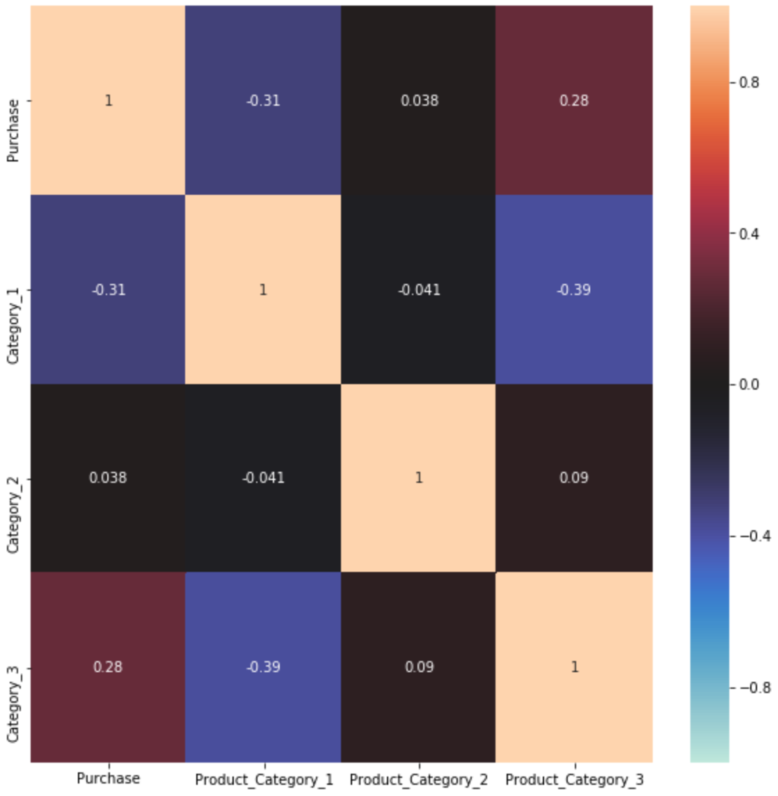
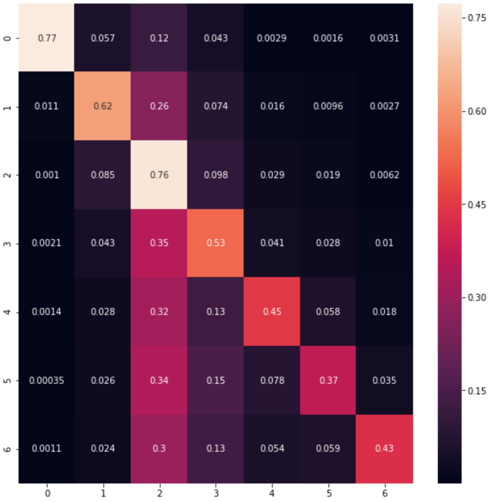

# Black Friday --- A study of sales through consumer behaviors

The dataset here is a sample of the transactions made in a retail store. The store wants to know the customer purchase behaviors better. This dataset contains different kinds of variables either numerical and categorical. 

There are several following questions need to be concerned:
1. What is the accuracy of predicting the amount of purchase? and which features are more important for predicting the amount of purchase?
   
2. What is the accuracy of predicting the age of the consumer? and which features are more important for predicting the age of the consumer?
   
3. What is the accuracy of predicting the category of goods bought? and which features are more important for predicting the category of goods bought?


# DATASET
Data Source: https://www.kaggle.com/mehdidag/black-friday

According to the initial analysis, the basic information of the Black Friday dataset has been summarized as follows. There are a lot of details in the 'Exploring the Dataset' part.

## Input variables:
Have used 10 of the following variables each time for predicting 3 different output variables: Purchase, Age and Product_Category_1

```
Product_ID
Gender
Age
Occupation
City_Category
Stay_In_Current_City_Years
Marital_Status
Product_Category_1
Product_Category_2
Product_Category_3
Purchase
```

## Output variables:
There are three following output variables need to be predicted:

```
Purchase
Predict the amount of purchase with the help of the information contained in the other 10 variables

Age
Predict the age of the consumer with the help of the information contained in the other 10 variables

Product_Category_1
Predict the category of goods bought in category1 with the help of the information contained in the other 10 variables
```

## Basic information
```
Number of Observations: 537577
Number of Attributes : 12
Use_ID is the only variable which doesn't include in the input variables
```

```
Missing values (There is no missing value in the variables except the following two columns):
Product_Category_2: 166986
Product_Category_3: 373299
```

# Results
1. Evaluate which product category and the purchase has high correlation with each other by heatmap.


2. Confusion matrix to visualize the accuracy of predicting each age group of consumer:'0-17','55+','26-35','46-50','51-55','36-45','18-25'.

